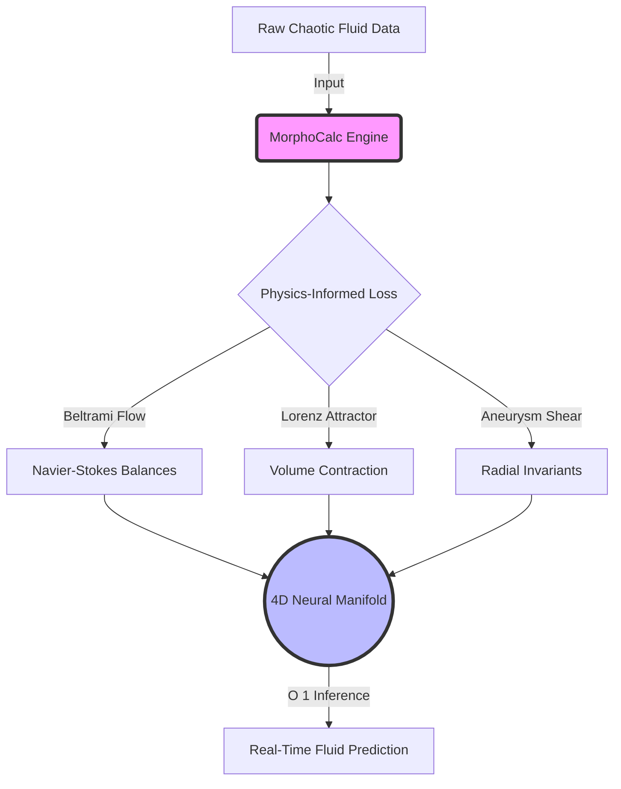

# 🌊 MorphoCalc 

> **A Morpho-Computational Calculus framework to simplify and accelerate complex fluid dynamics and Navier-Stokes equations.**

[](https://colab.research.google.com/)


## Overview

For 200 years, the Navier-Stokes equations have presented an insurmountable mathematical challenge, forcing physicists to rely on computationally expensive $O(N^3)$ numerical integration (supercomputers) to simulate chaos, weather, and hemodynamics. 

**MorphoCalc bypasses traditional numerical integration entirely.** By leveraging a Physics-Informed Neural Network (PINN) built on the SIREN architecture, MorphoCalc maps complex boundary conditions and chaotic physical laws into a continuous 4D neural manifold. Once trained, the network acts as a highly optimized surrogate solver, predicting fluid dynamics in $O(1)$ time complexity (milliseconds).

## 🧠 Architecture: How it Works



## Core Capabilities
- **Real-Time Meteorology:** Predict chaotic atmospheric shifts instantly, without supercomputer latency.
- **Biomedical Fluid Dynamics:** Calculate pulsating shear stress in arterial aneurysms in real-time, enabling instant diagnostic tools on consumer hardware.
- **Topological Turbulence:** Model exact Beltrami flow cancellations (ABC flows) via neural manifolds.

## Installation

```bash
git clone https://github.com/raghav/MorphoCalc.git
cd MorphoCalc
pip install -e .
```

## Usage

### 1. Generating the Neural Manifold
Train the SIREN network and map the topological geometry of chaotic flows:
```bash
morphocalc-engine
```

### 2. Decoding Geometric Invariants
Analyze the generated coordinate clouds and output the conserved geometric laws:
```bash
morphocalc-decoder
```

---

### 👨‍💻 About the Author
**MorphoCalc was independently developed and engineered by a high school student.** 
This project was built to demonstrate that the future of computational physics does not belong to massive supercomputers, but to efficient, intelligent neural surrogate architectures. If you find this repository useful, please consider giving it a ⭐!
